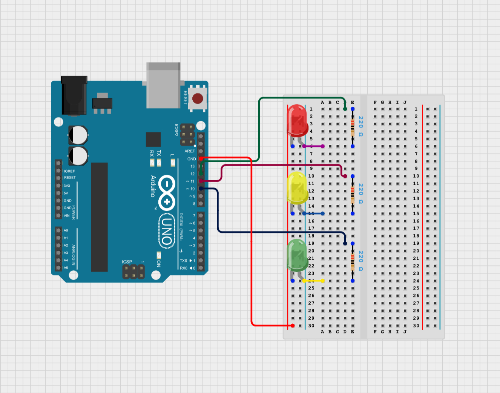

  # Wrist Rehab Monitor
Wrist Rehab Monitor because my wrist got injured from badminton.
You should comment out all portions of your portfolio that you have not completed yet, as well as any instructions:


| **Engineer** | **School** | **Area of Interest** | **Grade** |
|:--:|:--:|:--:|:--:|
| Nathan S | Gunn High | Mechanical Engineering | Incoming Sophomore

**Replace the BlueStamp logo below with an image of yourself and your completed project. Follow the guide [here](https://tomcam.github.io/least-github-pages/adding-images-github-pages-site.html) if you need help.**

  
# Final Milestone

**Don't forget to replace the text below with the embedding for your milestone video. Go to Youtube, click Share -> Embed, and copy and paste the code to replace what's below.**

<iframe width="560" height="315" src="https://www.youtube.com/embed/F7M7imOVGug" title="YouTube video player" frameborder="0" allow="accelerometer; autoplay; clipboard-write; encrypted-media; gyroscope; picture-in-picture; web-share" allowfullscreen></iframe>

For your final milestone, explain the outcome of your project. Key details to include are:
- What you've accomplished since your previous milestone
- What your biggest challenges and triumphs were at BSE
- A summary of key topics you learned about
- What you hope to learn in the future after everything you've learned at BSE


# Second Milestone

**Don't forget to replace the text below with the embedding for your milestone video. Go to Youtube, click Share -> Embed, and copy and paste the code to replace what's below.**

<iframe width="560" height="315" src="https://www.youtube.com/embed/zGtJvBaJgOA?si=yHCSrj1Uw0e5ISD-" title="YouTube video player" frameborder="0" allow="accelerometer; autoplay; clipboard-write; encrypted-media; gyroscope; picture-in-picture; web-share" referrerpolicy="strict-origin-when-cross-origin" allowfullscreen></iframe>

# Description
Before working with LSM6DS3 + LIS3MD, I learned about how it worked. The LSM6DS3 + LIS3MDL is a sensor combo that includes an accelerometer, a gyroscope, and a magnetometer. The accelerometer measures movement or tilt (like if something is going up, down, or sideways). The gyroscope measures rotation and angular velocity (like turning or spinning). The magnetometer works like a digital compass, as it can sense direction based on the Earth's magnetic field. All together, these three sensors help track motion and orientation in three axes. Inside the accelerometer there’s a tiny mass called a proof mass that moves a little when the device moves. Because of inertia, this mass resists changes in motion. When the device accelerates, a force (F) acts on the mass, and according to Newton’s second law F = ma, this force is equal to the mass times its acceleration. This force causes the proof mass to push or pull on a spring. This movement changes an electrical property in the sensor, like resistance, which the sensor turns into an electrical signal. By measuring that signal, we can tell how much the device is accelerating and in what direction.


Figure# - Accelerometer diagram

For the sake of not typing out "LSM6DS3+LIS3MDL" every single time, from now on I will just call it "accelerometer" or "module". For my second milestone, I first connected my accelerometer to my esp32. Then I downloaded a bunch of libraries for the module. It took a couple times because there were many codes for different versions of the accelerometer. But after finding the correct code off the library, I was able to upload the code and get my values for the accelerometer. The accelerometer had values x, y and z, and it also had gyro data, which measured angular velocity. However, I didn't use gyro data as the movment of my wrist would be relatively slow, and velocity values wouldn't have varied enough in movement for me to use them. When I rotate the accelerometer in a certain way, the values change. When stationary, the z value always hovers at around 9.8 m/s^2 due to gravity.


Figure# - Accelerometer data

I originally planned on using these values to put a threshold on them and also make the LED and piezo buzzer. However, when I put the accelerometer on my wrist, I realized that the accelerometer values had minimal change when I moved my wrist side to side. Accelerometer values weren't going to work for my side to side motion on the wrist. So, I downloaded the Madgwick filter from the library, and took a code off of it. This Madgwick filter code changed my acceleration x,y and z data into roll pitch and yaw data. Roll, pitch and yaw are usually used for aviation (see figure below). 


Figure# - Roll, pitch, and yaw diagram

For my side to side motion, yaw was the perfect fit as it calculated the angles when I rotated my wrist. At the stable position with the accelerometer facing straight, the angle measured 360 degrees. I wanted my side to side movement to trigger the buzzer and LED after a certain angle that my wrist went past. So I first set two thresholds, one when my wrist went right and the other for when my wrist went left. I set my first value at 40 deg to the left, and 340 deg for the right, which is 20 deg off from center position. When my wrist angle went past these certain angles, the LED would turn on and the buzzer would beep. One thing to note was that my data values for yaw were drifiting heavily; the values were constantly decreasing even without any movement on the accelerometer. Realizing that there would always be some drifting for my yaw values, completely scratched the idea of having thresholds on my accelerometer. 

I repurposed my accelerometer to graph data whenever I fully rotated my wrist. I wanted my wrist rehab device to track things like how many rotations someone has done or track the range of motion from a wrist. To make the graph from my accelerometer data values, I first changed my code. I took out all the thresholds, and replaced the code to first print out only roll and pitch. Since my yaw data kept drifitng, I just decided to not use it at all. I also decided to change my data outputs to CSV which is comma seperated variables. These comma seperated variables had no words, only numerical values seperated by commas, which would be easier to be plotted by a serial plotter. Then I downloaded a seperated serial monitor/plotter as the one on arduino was very laggy. When I first plotted the values, the graph was very unstable. After fixing this issue, the graph was working properly, with the roll and pitch values spiking whenever I rotated my wrist. 

After graphing the roll and pitch properly, I decided to find thresholds for only the pitch, which is the up and down motion. For one exercise such as the wrist rotation, the pitch and roll goes up and down, but for an exercise like wrist flexing, the roll doesn't change and only the pitch goes up and down. For now, I decided to only find the pitch thresholds to be simple. I set the high pitch threshold at 20 degrees, and the low pitch threshold at -38 degrees. However, a wrist rotation or a flex motion too slow doesn't have much affect. So, I millis function and variables in order to start a timer when the pitch value hit the high threshold (refer to Milestone 2 Threshold and Counter Code, Appendix). If the time that is spent getting to the lower threshold from the higher threshold is greater than 1.75 seconds, that specific rotation won't count towards a repition. 

I wanted a way to keep track of each repition that went above 20 deg and below -38 deg in the span of 1.75 seconds. So, in the code, I made a repCount variable to count how many reps of the wrist rotation or flex that I had done. The repCount starts at 0 and every rep, the count is increased by 1 untill 10. Then, I also added a set count. I used a setCount variable to keep track of sets. If the repCount hit 10, the repCount would be set back to 0, and the setCount would go up by one. After 3 sets, the setCount would be set back to 0, and the exercise would be complete. 

Since measuring data or finding thresholds while the wrist was unstable or moving too much was not reliable, I added a calibration system to the wrist rehab monitor. I wanted the pitch to be relatively close to 0 when starting the exercises, so I put the calibration range to -2 to 2 degrees. If the wrist was in this position for pitch, I considered it safe enough to start exercising. I also put a time requierment of 3 seconds. The pitch data had to be at -2 to 2 for at least 3 seconds before the calibration process was complete. While it wasn't calibrated, the serial monitor prints out "Calibrating...", and when after the 3 seconds of calibration, the serial monitor starts printing the repCount and setCounts. 

# Challenges
A big challenge that I faced in this milestone is that my yaw values kept on drifting, even in the stationary position. At first I thought this was because of the built in compass. The accelerometer module calculates yaw using the built in compass and magnometer. However, in a room full of magnetically conductive materials, these calculations may have been off. So in my code, I told arduino to not use the compass, in hopes that the yaw data would stop drifting. After doing some research, I learned that no matter what, due to certain limitations within the sensor or environment, there would always be some drift in yaw values. The only real way to fix it was to press the reboot button on my esp32 So, I repurposed my accelerometer. Also because I realized that I wouldn't really be moving my wrist from side to side. Another challenge that I faced was incorrect graph readings. When I first printed my data values for roll and pitch, I didn't use csv, and the words "roll" and "pitch" were also printed. This lead to unstable graphs, and only one line of value, instead of two for roll and pitch (see figure# below). So, I altered the print lines in the code to only print numerical values, seperated by commas. This time when I made the graph, it had two lines for roll and pitch, but it was very unstable. So I altered my code again. This time, I created a loop that took the average of 5 readings for roll and pitch, then gave me the value of the averages (see Milstone 2 Average code, Appendix). While this graph did look more stable, the lables on the y axis didn't make sense. When I rotated my wrist, I was making big angular changes in position. Since roll and pitch measures angles, there should have been pretty big spacing on the y axis. So, I also scratched this code. I went back to my first problem, when my graph was unstable. I changed the sample frequency to 20 milliseconds, and the delay time to 50 milliseconds. The delay time (50) times the sample frequency (20) was 1000 milliseconds, which made for a more stable graph. Now the angle readings were also correct. Every time I completed a rotation, the values would spike at a consistent height. 


<p float="left">
  

   

   

</p>

Figure# - Graphs of roll and pitch, with time on the x axis and roll and pitch angles on the y axis
Graph 1 - First unstable graph WITHOUT csv

Graph 2 - Second graph WITH csv and averaging

Graph 3 - Third graph WITH csv and NO averaging

Creating the calibration system was also a bit challenging because of the timer. I had to use the millis function and lots of variables to calculate the exact time. The inRangeStart timer starts counting as soon as the wrists position goes in the range of -2 to 2. For 3 seconds the wrist position must stay in this range. If at any point it exists the range, the inRangeStart timer will reset. This calibration system ensures that the tracking only starts when I'm at a consistent starting position.   

# Next Steps
Next, I will sew my accelerometer on my wrist compression sleeve so I don't have to keep holding on to it, and so the movement of the accelerometer is more natural. I'm also going to figure out the bluetooth on my esp32 because I want to display some certain texts on the serial monitor on my phone, and having the esp32 always connect to the computer is a bit inconvenient.


# First Milestone

<iframe width="560" height="315" src="https://www.youtube.com/embed/UryxP8tovaY?si=vhKdE8WHcJufKPs5" title="YouTube video player" frameborder="0" allow="accelerometer; autoplay; clipboard-write; encrypted-media; gyroscope; picture-in-picture; web-share" referrerpolicy="strict-origin-when-cross-origin" allowfullscreen></iframe>

# Description
As a part of my first milestone and learning experience, I decided to make a mini project using the arduino to figure out some basic coding in C++. I made a little sequence of lights that acted light traffic lights, with decently accurate time delays to replicated real life traffic lights. In the code, the leds that I used work of a digital signal to turn it on (HIGH) or off (LOW). The code digitalWrite signals these on and offs (see code below, traffic light code, Appendix). I also used some 220 ohm resistors as these were the best fit from the Law of Ohm calculations. The arduino charged 5 volts, and the leds current value was 0.02, so the right resistor to use was near 250 ohms. The close option was 220, so thats what I decided to use. 



Figure# - Traffic light arduino project

My first milestone was to connect the flex sensor to the esp32 (main controlling unit), and also add threshold values. The code I'd have to make is that when the threshold is exceeded by bending the sensor, the LED and piezo buzzer that I connected would beep and turn on. The flex sensor is a big resistor, and bending it to a certain degree changes the resistance values. Conductive ink sits on the top of the flex sensor, and when it is bent, the ink outside of the bend is stretched, leading to increased resistance. This is what changed the actual number values that were output by the sensor (see figure below). I printed these flex sensor values to find my threshold for the LED and buzzer. When the flex sensor is straight, it outputs a value of 1800, and when bending to a degree the number increases or decreases. Since I planned to use the flex sensor for detecting bend in only one direction, I only need one threshold. I set my LED and buzzer threshold at 2400. The code allows it so that once the flex sensor threshold is exceeded, the led and buzzer status is set to HIGH which turns it on, and in the other case, they are both set to LOW. I used analog read because the flex sensor is connected to pinA6 on the esp32, which is an analog pin. When the sensor bends, the resistance changes, so voltage at the analog pin changes, and the analog read reads the data values.(see code below, Milestone 1 code, Appendix). 


Figure# - Flex sensor diagram

# Challenges
Some challenges that I faced were connecting things to the esp32 and the breadboard. The breadboard layout was confusing at first, as I didn't really understand how the electricity path flowed throughout the board. Another challenge was connecting the flex sensor. The flex sensor works off a voltage divider, which is a small circuit that that reduces voltage to a lower level, dividing input voltage into smaller outputs. I had to search some online schematics that showed me how to connect the flex sensor to the esp32. I also tried connecting the LSM6DS3+LIS3MDL (accel,gyro and magnometer), but I realized that I would also have to connect the codes and find more thresholds, so I saved that for the next milestone.

# Next Steps
My next plan is to connect the accelerometer to my esp32, and also get the threshold values for that sensor. As of now, I downloaded a code from the library that lets my LSM6DS3+LIS3MDL sensor give me acceleration and angular velocity data for the x, y and z axis. I plan on using some of the these values as threshold for the next step. The flex sensor will sit on the top of my wrist, regulating the up and down motions, while the LSM6DS3+LIS3MDL will regulate side to side motions on my wrist.
# Schematics 


Figure # - Flex sensor connected with led and buzzer to esp32

# Bill of Materials
Here's where you'll list the parts in your project. To add more rows, just copy and paste the example rows below.
Don't forget to place the link of where to buy each component inside the quotation marks in the corresponding row after href =. Follow the guide [here]([url](https://www.markdownguide.org/extended-syntax/)) to learn how to customize this to your project needs. 

| **Part** | **Note** | **Price** | **Link** |
|:--:|:--:|:--:|:--:|
| Item Name | What the item is used for | $Price | <a href="https://www.amazon.com/Arduino-A000066-ARDUINO-UNO-R3/dp/B008GRTSV6/"> Link </a> |
| Item Name | What the item is used for | $Price | <a href="https://www.amazon.com/Arduino-A000066-ARDUINO-UNO-R3/dp/B008GRTSV6/"> Link </a> |
| Item Name | What the item is used for | $Price | <a href="https://www.amazon.com/Arduino-A000066-ARDUINO-UNO-R3/dp/B008GRTSV6/"> Link </a> |

# Other Resources/Examples
One of the best parts about Github is that you can view how other people set up their own work. Here are some past BSE portfolios that are awesome examples. You can view how they set up their portfolio, and you can view their index.md files to understand how they implemented different portfolio components.
- [Example 1](https://trashytuber.github.io/YimingJiaBlueStamp/)
- [Example 2](https://sviatil0.github.io/Sviatoslav_BSE/)
- [Example 3](https://arneshkumar.github.io/arneshbluestamp/)

# Starter Project - Retro Arcade Console

<iframe width="560" height="315" src="https://www.youtube.com/embed/lbEyTJAkzWc?si=9pJWD1YZEUp0lTTe" title="YouTube video player" frameborder="0" allow="accelerometer; autoplay; clipboard-write; encrypted-media; gyroscope; picture-in-picture; web-share" referrerpolicy="strict-origin-when-cross-origin" allowfullscreen></iframe>

# Description 
  My starter project was the Retro Arcade Console, and I chose it because there were only two options and the console seemed somewhat more fun. It was my first time soldering, and the project really helped as there were many joints to solder. I learned many soldering skills such as a through hole joint, soldeirng wires, stripping wires, and de-soldering. The console has a couple games such as tetris and a bad version of galaga. The 4 buttons consisting of up, down, left, and right on the left are the actual controls, while the up and down button are used for things such as selecting or firing. The two big LED matrices act as the screens, and there is also an LED scoreboard at the top. The console is also powered by usb or three AA batteries.

# Challenges 
  One challenge was that when I tried to power my console with batteries, It wouldn't turn on at all. I checked my wires and I realized that during my soldering process, I had accidentally burned a part of the ground wire, which wouldn't allow it to turn on. So I had to cut the wire to take out the burnt part, and then strip the wire. After soldering the wire back together and using a heat shrink, the console worked perfectly fine through battery power. 
  
# Next Steps
  I will use the skills that I learnt from my starter project and apply it to my intensive project, the Wrist Rehab Device. Since I dont know how to use an Arduino or how to code, I'm going to start on learning the basics first. Then I will start to work on my intensive project.  

# Appendix
# Traffic Light code
```c++

void setup() {
  // put your setup code here, to run once:
  pinMode(12,OUTPUT);
  pinMode(11,OUTPUT);
  pinMode(10,OUTPUT);
}

  
void loop() {
  // put your main code here, to run repeatedly:
  digitalWrite(12,HIGH);
  delay(6000);
  digitalWrite(12,LOW);
  digitalWrite(10,HIGH);
  delay(2000);
  digitalWrite(10,LOW);
  digitalWrite(11,HIGH);
  delay(1000);
  digitalWrite(11,LOW);

}

```

# Milestone 1 code
```c++

const int flexPin = A6;           //Flex sensor pin to A6 (esp32)
const int ledPin = 23;            //Led pin to 23 (esp32)
const int buzzer = 19;            //buzzer pin to 19 (esp32)

void setup() { 
  Serial.begin(115200);           //baud rate to 115200
  pinMode(ledPin,OUTPUT);         //set led as an output
  pinMode(buzzer,OUTPUT);         //set buzzer pin as an output
} 

void loop(){ 
  int flexValue;                  //flex sensor numerical outputs set as integers
  flexValue = analogRead(flexPin);//read flex sensor
  Serial.print("sensor: ");
  Serial.println(flexValue);
 
  if(flexValue>2400) {            //flex value threshold
     digitalWrite(ledPin,HIGH);   //turns on led if threshold exceeds
     digitalWrite(buzzer,HIGH);   //turns on buzzer if threshold exceeds
  }
  else {
    digitalWrite(ledPin,LOW);     //nothing happens if threshold is not exceeded
    digitalWrite(buzzer,LOW);
  }
  delay(20);
  
} 
```

# Milestone 2 Average code 
```c++
#include <Wire.h>                             //inclue these from library
#include <Adafruit_LSM6DS3TRC.h>
#include <Adafruit_LIS3MDL.h>
#include <MadgwickAHRS.h>

Adafruit_LSM6DS3TRC lsm6ds3trc;
Adafruit_LIS3MDL lis3mdl = Adafruit_LIS3MDL();
Madgwick filter;

const float sampleFreq = 20.0;                // sample frequency of 20 hertz
float average;                
float averagep;
int  cnt=0;
int  cntp=0;

void setup() {
  Serial.begin(115200);
  while (!Serial) delay(10);

  if (!lsm6ds3trc.begin_I2C()) {
    Serial.println("Failed to find LSM6DS3TR-C!");
    while (1) delay(10);
  }

  if (!lis3mdl.begin_I2C()) {
    Serial.println("Failed to find LIS3MDL!");
    while (1) delay(10);
  }

  filter.begin(sampleFreq);
}

void loop() {
  sensors_event_t accel, gyro, temp;          //create events
  sensors_event_t mag;

  lsm6ds3trc.getEvent(&accel, &gyro, &temp);  //read data from these
  lis3mdl.getEvent(&mag);                     //read data from magnometer

  float gx = gyro.gyro.x * 180.0 / PI;        //convert radians per sec to degress per sec
  float gy = gyro.gyro.y * 180.0 / PI;
  float gz = gyro.gyro.z * 180.0 / PI;

  float ax = accel.acceleration.x / 9.80665;  //convert acceleration from m/s^2 to G force
  float ay = accel.acceleration.y / 9.80665;
  float az = accel.acceleration.z / 9.80665;

  filter.update(gx, gy, gz, ax, ay, az, mag.magnetic.x, mag.magnetic.y, mag.magnetic.z);

  float roll = filter.getRoll();              //Get current roll and pitch values from sensor
  float pitch = filter.getPitch();

  
    float sumr=sumr+roll;                     //current sum = past sum + value of roll or pitch
  cnt=cnt+1;

  float sump=sump+pitch;
  cntp=cntp+1;
  

  

  // Serial Plotter format: label:value, separated by commas

  if(cnt==4){                                //Set count limit to 4, start at 0
    average=sumr/5;                          //After 5 counts, take average of sum
    Serial.print(" ");                       //print average
    Serial.println(average);
    cnt=0;                                   //set count and sum back to 0
    sumr=0;
  }
  if(cntp==4){
    averagep=sump/5;
    Serial.print(", ");
    Serial.println(averagep);
    cntp=0;
    sump=0;
  }
  
  delay(50); // ~100Hz
} 
```

# Milestone 2 Threshold and Counter Code
```c++
#include <Wire.h>
#include <Adafruit_LSM6DS3TRC.h>
#include <Adafruit_LIS3MDL.h>
#include <MadgwickAHRS.h>

Adafruit_LSM6DS3TRC lsm6ds3trc;
Adafruit_LIS3MDL lis3mdl = Adafruit_LIS3MDL();
Madgwick filter;

const float sampleFreq = 20.0;

unsigned long inRangeStart = 0;
unsigned long repStart = 0;

bool calibrated = false;
bool waitingForDip = false;

int repCount = 0;
int setCount = 0;
void setup() {
  Serial.begin(115200);
  while (!Serial) delay(10);

  if (!lsm6ds3trc.begin_I2C()) {
    Serial.println("Failed to find LSM6DS3TR-C!");
    while (1) delay(10);
  }

  if (!lis3mdl.begin_I2C()) {
    Serial.println("Failed to find LIS3MDL!");
    while (1) delay(10);
  }

  filter.begin(sampleFreq);
}

void loop() {
  sensors_event_t accel, gyro, temp;
  sensors_event_t mag;

  lsm6ds3trc.getEvent(&accel, &gyro, &temp);
  lis3mdl.getEvent(&mag);

  float gx = gyro.gyro.x * 180.0 / PI;
  float gy = gyro.gyro.y * 180.0 / PI;
  float gz = gyro.gyro.z * 180.0 / PI;

  float ax = accel.acceleration.x / 9.80665;
  float ay = accel.acceleration.y / 9.80665;
  float az = accel.acceleration.z / 9.80665;

  filter.update(gx, gy, gz, ax, ay, az, mag.magnetic.x, mag.magnetic.y, mag.magnetic.z);

  float roll = filter.getRoll();
  float pitch = filter.getPitch();

  unsigned long currentTime = millis();

  // Calibration Logic
  if (!calibrated) {
    if (pitch >= -2 && pitch <= 2) {                                      //range of the calibration zone
      if (inRangeStart == 0) {                                            //check if timer is at 0
        inRangeStart = currentTime;                                       //
      } else if (currentTime - inRangeStart >= 3000) {                    //calibration finished after 3 seconds in range
        calibrated = true;
      }
    } else {
      inRangeStart = 0;                                                   //set timer back to 0 if exited range
    }
  }

  
  if (calibrated) {                                                       //check if its calibrated
    if (!waitingForDip && pitch >= 20) {                                  //waiting for dip is false and pitch goes above 28
      repStart = currentTime;                                             //rep time starts
      waitingForDip = true;                                               //waiting for dip turned true
    }

    if (waitingForDip) {                                                  //check waiting for dip is true
      if (pitch <= -38 && (currentTime - repStart <= 1750)) {             //if pitch goes under -38 in under 1.75 seconds
        repCount++;                                                       //increase repCount
        waitingForDip = false;                                            //set waiting for dip to false
        if(repCount == 11){
          setCount++;
          repCount = 0;
        }
      } 
  

      
      if (currentTime - repStart > 1750) {                                //if over 1.75 seconds
        waitingForDip = false;                                            //reset waiting time
      }
    }
  }


  Serial.print(roll, 2);
  Serial.print(", ");
  Serial.print(pitch, 2);
  Serial.print(", ");

  if (!calibrated) {
    Serial.println("Calibrating...");
  } else {
    Serial.print("reps: ");
    Serial.print(repCount);
    Serial.print(", ");
    Serial.print("sets: ");
    Serial.println(setCount);
      if(setCount == 3){
        Serial.println("Exercise Complete!");                             //print out when the exercise is complete
        setCount=0;
      }
       
  }
  
  delay(50);
}
```

# Milestone 3 Neopixel Code
```c++
#include <Adafruit_NeoPixel.h>

#define PIN         13                                                      //lights to  pin 13 
#define NUMPIXELS   6                                                       //number of lights
#define FLEXPIN     34                                                      //
#define FLEX_THRESHOLD 2400                                                 //flex threshold at 2400 for lights

Adafruit_NeoPixel strip(NUMPIXELS, PIN, NEO_GRB + NEO_KHZ800);

bool sequenceRunning = false;
unsigned long lastStepTime = 0;                     
int currentPixel = 0;

void setup() {
  Serial.begin(115200);
  strip.begin();                                                 //wake up lights and prepare 
  strip.show();                                                  //start with lights off
}

void loop() {
  int flexValue = analogRead(FLEXPIN);                           //read flex sensor
  Serial.print("Flex: ");
  Serial.println(flexValue);

  
  if (flexValue > FLEX_THRESHOLD && !sequenceRunning) {         //if the threshold is exceed and the lights are not on,
    sequenceRunning = true;                                     //sequence is turned on
    currentPixel = 0;                                           
    lastStepTime = millis();
    strip.clear();
  }

  if (sequenceRunning) {
    if (flexValue < FLEX_THRESHOLD) {
      resetStrip();                                             //reset lights if flex sensor is released 
      return;
    }

    if (millis() - lastStepTime >= 500 && currentPixel < NUMPIXELS) {     
      strip.setPixelColor(currentPixel, strip.Color(0, 0, 255));          //set light to color blue
      strip.show();                                                       //show color
      currentPixel++;                                                     //next light
      lastStepTime = millis();                                            //reset 0.5 second timer again
    }

    if (currentPixel == NUMPIXELS) {                                      //if the number of pixels reaches 6
      strip.fill(strip.Color(0, 255, 0));                                 //set ALL lights color to green
      strip.show();
      delay(2000);                                          
      resetStrip();                                                       //reset after two seconds
    }       
  }

  delay(50);
}

void resetStrip() {
  strip.clear();
  strip.show();
  sequenceRunning = false;
  currentPixel = 0;
}
```
